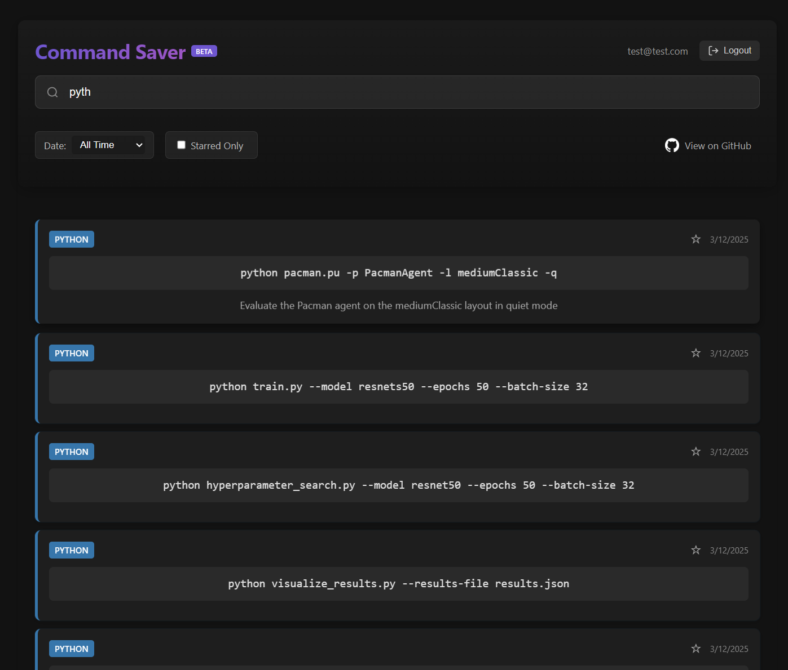
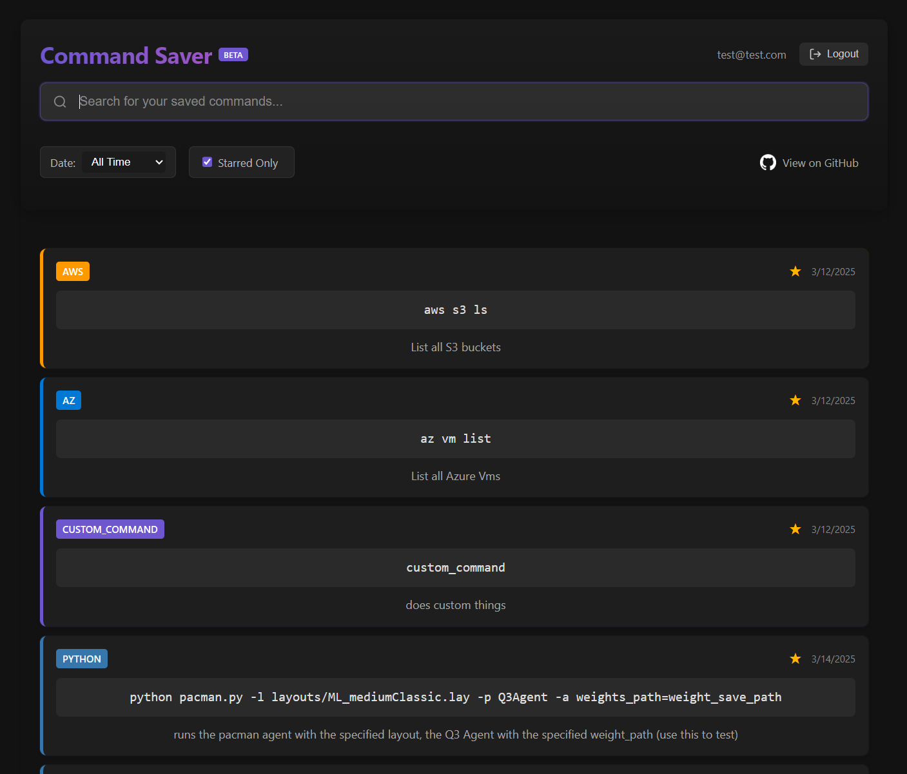
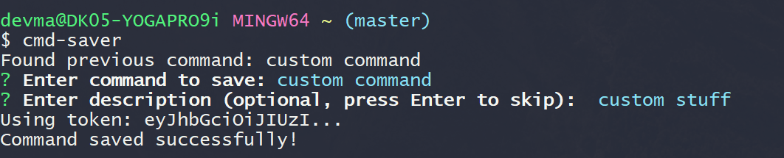
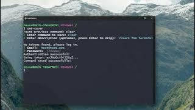

# CLI Saver App

CLI Saver App is a full-stack application that allows users to save and manage their frequently used CLI commands. The app provides a user-friendly interface to search, filter, and star commands for easy access.

There are two parts:

1. A CLI Tool that the user installs via npm
2. The Website hosted [here](https://cli-saver-app-e80303b94dbf.herokuapp.com/) (or the user can choose to self-host with low overhead)

## Installation

To install the CLI tool globally, run:

```bash
npm install -g @dev4narayou/cmd-saver
```

Make sure to register -> [here](https://cli-saver-app-e80303b94dbf.herokuapp.com/) <-

#### Usage

To save the last executed command, simply run:

```bash
cmd-saver
```

You will be prompted to log in with your email and password the first time you use the tool. The tool will then save the last executed command to your account on the CLI Saver App.

(You will be given the option to edit, and add descriptions, but by default, the last run command is immediately captured and ready to save)

### Screenshots of the Running Site





### Screenshots of the tool in action



### Video Demo

Watch the video demo of the CLI Saver App:

[](https://youtu.be/BqV1HaenN-4)

## Features

- User authentication (login and registration)
- Save and manage CLI commands
- Search and filter commands by date and starred status
- Responsive design for desktop and mobile devices
- CLI tool for saving commands directly from the terminal

## Technologies Used

### Frontend
- **React**
- **Vite**
- **CSS**

### Backend
- **Node.js**
- **Express.js**
- **Supabase**
- **JWT**
- **Axios**

### Deployment & Tools
- **Git**
- **Heroku**
- **npm**
- **Bash**

## Usage

You can access the hosted application at [CLI Saver App](https://cli-saver-app-e80303b94dbf.herokuapp.com/).


## License

This project is licensed under the ISC License.

## Acknowledgements

- [Supabase](https://supabase.io/)
- [React](https://reactjs.org/)
- [Express.js](https://expressjs.com/)
- [Heroku](https://www.heroku.com/)
